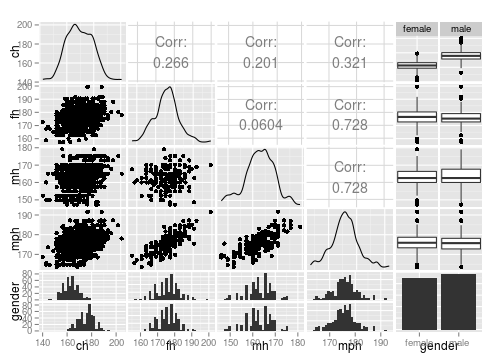
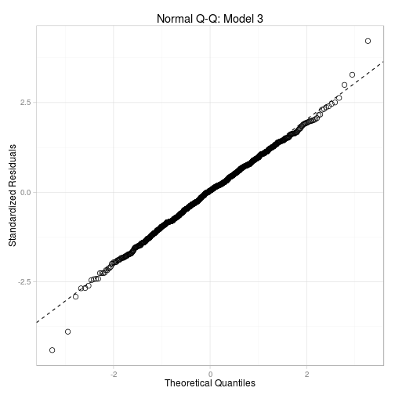

Interactive prediction of a child's height - Revisiting a Victorian Era dataset
========================================================
author: Jesus M. Castagnetto
date: 2015-07-22
width: 1200
height: 900
transition: rotate

Background
========================================================

- I used the dataset `GaltonFamilies`, in the
  [HistData](https://cran.r-project.org/web/packages/HistData/) R package, to
  create a predictive model for child's height.
- The heights in the dataset were converted to centimenters using
  the equivalence: 1 inch = 2.54 cm.
- The model predicts a child's height (in cm.), given
  the father's and mother's heights (in cm.), as well as the child's gender.
- The dataset originates from an 1886 study by Francis Galton (*vide infra*), in which he
  concludes that using the average height of the parents (the "mid-parent"
  height) is a sufficient predictor of his/hers stature.

<small>
Galton, F. "Regression Towards Mediocrity in Hereditary Stature",
The Journal of the Anthropological Institute of Great Britain and Ireland
Vol. 15 (1886), pp. 246-263, DOI: 10.2307/2841583
</small>

Looking at the correlation
========================================================

 

<small>
Height variables (in cm.): **ch** (child),
**fh** (father), **mh** (mother), and **mph** (mid-parent).
The **gender** factor: female/male.
</small>

***

The child's height is moderately correlated with the father's,
mother's and midparent's heights.

Considering the sample distributions of
heights by gender, we observe a distinct difference, so the
child's gender is an important factor in any predictive model.

Picking a linear model
========================================================

First I used Galton's assumption, considering only
the mid-parent's height, resulting in a model with a low $R^2$.
That is why I tried a couple more models that included the child's gender, as
summarized below:

| Model|Formula               | Adj. $R^2$|
|-----:|:---------------------|----------:|
|     1|ch ~ mph              |     0.1030|
|     2|ch ~ mph + gender     |     0.6332|
|     3|ch ~ fh + mh + gender |     0.6354|

<small>
*Where*:
`fh`: father's height, `mh`: mother's height,
`mph`: midparent's height, `ch`: child's height,
`gender`: child's gender
</small>

***

 

The last model gives a slightly better fit, with a reasonable QQ-plot, and is
the one I used for the Shiny App.

Final thoughts
========================================================

- The Shiny App brings to life in a simple and interactive way, research done
  in Victorian times <tt>:-)</tt>
- I did not implement range validation in the `serve.R` code, so you could
  put non-sensical values (negative, for example), and you will still get a
  prediction... Perhaps that could be done in the next version of the app.
- You would think that with genetic data we can now do better predictions of
  a phenotypical trait such as height, but that is not the case (*vide infra*),
  the old Victorian method is not only cost effective, but also more robust.

Go and play with [my Shiny App](https://jmcastagnetto.shinyapps.io/predict-child-height) --
Read the [code @github](https://github.com/jmcastagnetto/coursera-data-products-july2015)

<small>
Aulchenko, Y.S.; et. al.
"[Predicting human height by Victorian and genomic methods](http://www.nature.com/ejhg/journal/v17/n8/full/ejhg20095a.html)"
European Journal of Human Genetics (2009) 17, 1070–1075, DOI: 10.1038/ejhg.2009.5
</small>
